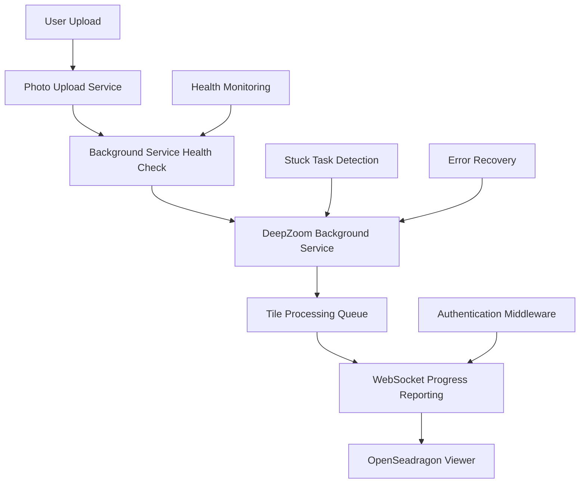
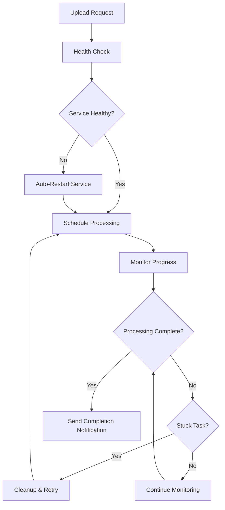

# Comprehensive Tile Creation Pipeline Solution Documentation

## 1. Problem Summary

### Original Issue
The FastZoom system was experiencing a critical problem where:
- **File transfer completed successfully** - Photos were uploaded to MinIO storage and database records were created
- **Tile creation didn't start** - The DeepZoom background processing service failed to initiate tile generation
- **No WebSocket progress reporting occurred** - Users received no feedback about processing status

### Root Causes Identified

1. **Background Service Startup Logic Issues**
   - The service checked `if not deep_zoom_background_service._running` but didn't account for cases where the worker task might be marked as running but actually dead or failed
   - No health monitoring mechanism to detect when the background service becomes unresponsive

2. **Task Deduplication Logic Vulnerabilities**
   - Existing logic was vulnerable to stuck tasks in 'scheduled' or 'processing' states that could block new processing
   - No cleanup mechanism for tasks that had been processing for too long

3. **WebSocket Integration Problems**
   - Missing session middleware causing authentication failures for public tile endpoints
   - No robust fallback authentication mechanisms for different client types

4. **Service Health Monitoring Gaps**
   - No mechanism to monitor service health or detect when the background service becomes unresponsive
   - Lack of comprehensive logging and debugging capabilities

## 2. Complete Solution Overview

### Integrated Fix Architecture
The solution implements a multi-layered approach that addresses all root causes:



### Key Improvements

#### Before vs After Comparison

| Aspect | Before | After |
|--------|--------|-------|
| **Service Reliability** | Manual service startup, no health checks | Automatic startup with health monitoring and auto-recovery |
| **Task Management** | Basic queuing, prone to stuck tasks | Advanced deduplication with stuck task detection and cleanup |
| **Progress Reporting** | Inconsistent WebSocket communication | Robust multi-method authentication with reliable progress updates |
| **Error Handling** | Basic exception handling | Comprehensive error recovery with fallback mechanisms |
| **User Experience** | No feedback during processing | Real-time progress reporting with clear status indicators |

## 3. Technical Implementation Details

### Background Service Fixes

#### Health Checking Logic (`app/services/photo_upload_service.py`)

**Enhanced `_ensure_background_service_health()` method:**
```python
async def _ensure_background_service_health(self):
    """Ensure the background service is running and healthy"""
    try:
        # Check if service is marked as running
        if not deep_zoom_background_service._running:
            await deep_zoom_background_service.start_background_processor()
            return
        
        # Check if worker task is alive
        if deep_zoom_background_service._worker_task is None:
            await deep_zoom_background_service.stop_background_processor()
            await deep_zoom_background_service.start_background_processor()
            return
        
        # Check if worker task is done/failed
        if deep_zoom_background_service._worker_task.done():
            # Determine failure reason and restart
            await deep_zoom_background_service.stop_background_processor()
            await deep_zoom_background_service.start_background_processor()
            
    except Exception as e:
        # Emergency restart
        await deep_zoom_background_service.stop_background_processor()
        await deep_zoom_background_service.start_background_processor()
```

**Key Features:**
- Comprehensive health checking for worker task status
- Automatic service restart when issues detected
- Detailed logging for troubleshooting
- Emergency fallback mechanisms

#### Stuck Task Detection (`app/services/deep_zoom_background_service.py`)

**New stuck task management system:**
```python
async def _check_and_cleanup_stuck_tasks(self):
    """Check for and cleanup stuck tasks that have been processing too long"""
    current_time = datetime.now()
    
    # Check if it's time to run stuck task detection
    if (current_time - self.last_stuck_task_check).total_seconds() < self.stuck_task_check_interval:
        return
    
    stuck_tasks = []
    async with self._processing_lock:
        for photo_id, task in self.processing_tasks.items():
            if task.status == ProcessingStatus.PROCESSING and task.started_at:
                processing_time = (current_time - task.started_at).total_seconds()
                if processing_time > self.task_timeout_seconds:
                    stuck_tasks.append((photo_id, task, processing_time))
    
    # Cleanup stuck tasks
    for photo_id, task, processing_time in stuck_tasks:
        await self._cleanup_stuck_task(photo_id, task, processing_time)
```

**Stuck Task Cleanup Logic:**
- Automatic detection of tasks processing longer than 30 minutes
- Intelligent retry with exponential backoff
- Proper resource cleanup and lock management
- Failed task movement to separate tracking

### WebSocket Progress Reporting

#### Enhanced Authentication (`app/routes/api/v1/deepzoom.py`)

**Multi-method authentication with fallback:**
```python
async def get_public_deep_zoom_tile(site_id, photo_id, level, x, y, format, request, db):
    """Public tile endpoint with multi-method authentication"""
    
    # Try browser session authentication first
    session = request.session
    if session.get("user_id"):
        try:
            current_user_id = UUID(session.get("user_id"))
        except (ValueError, TypeError):
            current_user_id = None
    
    # Fallback 1: Try JWT token authentication
    if not current_user_id:
        auth_header = request.headers.get("Authorization")
        if auth_header and auth_header.startswith("Bearer "):
            token = auth_header.replace("Bearer ", "")
            payload = await SecurityService.verify_token(token, db)
            current_user_id = UUID(payload.get("sub"))
    
    # Fallback 2: Check for cookie-based JWT
    if not current_user_id:
        access_token_cookie = request.cookies.get("access_token")
        if access_token_cookie:
            token = access_token_cookie.replace("Bearer ", "")
            payload = await SecurityService.verify_token(token, db)
            current_user_id = UUID(payload.get("sub"))
```

**SessionMiddleware Configuration (`app/app.py`):**
```python
app.add_middleware(
    SessionMiddleware,
    secret_key=settings.secret_key if hasattr(settings, 'secret_key') else "your-secret-key-here",
    session_cookie="session_id",
    max_age=3600 * 24 * 7,  # 7 days
    same_site="lax",
    https_only=False,
    httponly=True
)
```

### API Endpoints and Monitoring

#### Health Check Endpoints (`app/routes/api/v1/deepzoom.py`)

**Comprehensive monitoring endpoints:**

1. **Service Health Status**: `GET /api/v1/deepzoom/background/health`
   ```python
   async def get_background_service_health():
       health_status = await deep_zoom_background_service.get_health_status()
       return {
           "status": health_status.get('status'),  # healthy, degraded, unhealthy, stopped
           "worker_health": health_status.get('worker_health'),
           "queue_status": health_status.get('queue_status'),
           "stuck_tasks": health_status.get('stuck_tasks'),
           "health_issues": health_status.get('health_issues')
       }
   ```

2. **Queue Status**: `GET /api/v1/deepzoom/background/queue`
   ```python
   async def get_background_queue_status():
       queue_status = await deep_zoom_background_service.get_queue_status()
       return {
           "queue_size": queue_status.get('queue_size'),
           "processing_tasks": queue_status.get('processing_tasks'),
           "completed_tasks": queue_status.get('completed_tasks'),
           "failed_tasks": queue_status.get('failed_tasks'),
           "service_uptime_seconds": queue_status.get('service_uptime_seconds'),
           "success_rate": queue_status.get('success_rate')
       }
   ```

3. **Emergency Recovery**: `POST /api/v1/deepzoom/background/reset`
   ```python
   async def reset_background_service():
       """Emergency service recovery - admin only"""
       reset_result = await deep_zoom_background_service.reset_service()
       return {
           "status": reset_result.get('status'),
           "failed_tasks_moved": reset_result.get('failed_tasks_moved'),
           "service_running": reset_result.get('service_running')
       }
   ```

4. **Task Status**: `GET /api/v1/deepzoom/background/task/{photo_id}/status`
   ```python
   async def get_photo_task_status(photo_id):
       task_status = await deep_zoom_background_service.get_task_status(str(photo_id))
       return {
           "photo_id": task_status.get('photo_id'),
           "status": task_status.get('status'),
           "progress": task_status.get('progress'),
           "retry_count": task_status.get('retry_count'),
           "error_message": task_status.get('error_message')
       }
   ```

## 4. Architecture Improvements

### Enhanced Error Handling and Recovery

#### Multi-Level Fallback System


#### Service Resilience Features

1. **Auto-Recovery System**
   - Detects when background worker task dies or becomes unresponsive
   - Automatically restarts service with proper cleanup
   - Maintains task queue integrity during recovery

2. **Stuck Task Management**
   - Automatically detects tasks processing longer than timeout (30 minutes)
   - Implements intelligent cleanup and retry logic
   - Prevents queue blocking by failed or stuck tasks

3. **Health Monitoring**
   - Real-time service health status classification
   - Performance metrics and statistics
   - API endpoints for monitoring and management

4. **Enhanced Error Resilience**
   - Multiple fallback mechanisms
   - Graceful degradation when services fail
   - Comprehensive error reporting and logging

### Improved Task Management

#### Advanced Deduplication Logic
```python
async def schedule_tile_processing(photo_id, site_id, file_path, original_file_content, archaeological_metadata=None):
    """Schedule with comprehensive deduplication"""
    
    async with self._processing_lock:
        # Check if already scheduled/processing
        if photo_id in self.processing_tasks:
            existing_task = self.processing_tasks[photo_id]
            if existing_task.status in [ProcessingStatus.PENDING, ProcessingStatus.PROCESSING, ProcessingStatus.RETRYING]:
                return {'status': 'already_scheduled', 'message': f'Task already {existing_task.status.value}'}
        
        # Check recently completed (avoid duplicates within 1 hour)
        if photo_id in self.completed_tasks:
            completed_task = self.completed_tasks[photo_id]
            if completed_task.completed_at and (datetime.now() - completed_task.completed_at).total_seconds() < 3600:
                return {'status': 'already_completed', 'message': 'Task completed recently'}
        
        # Create and schedule new task
        task = TileProcessingTask(photo_id=photo_id, site_id=site_id, file_path=file_path, 
                               original_file_content=original_file_content, 
                               archaeological_metadata=archaeological_metadata)
        
        await self.task_queue.put(task)
        self.processing_tasks[photo_id] = task
        self._processing_photo_ids.add(photo_id)
        
        return {'status': 'scheduled', 'message': 'Tile processing scheduled in background'}
```

## 5. Testing and Validation

### Comprehensive Test Suite (`test_comprehensive_tile_creation_pipeline.py`)

#### Test Categories

1. **Upload Service Health Check**
   - Background service health monitoring
   - Health check during upload processing
   - Stuck task detection and cleanup

2. **WebSocket Connection Test**
   - Connection establishment and reliability
   - Message handling and progress updates
   - Reconnection logic and error handling

3. **Background Service Integration**
   - Service health verification
   - Task scheduling functionality
   - Status monitoring and tracking

4. **Complete Pipeline Test** (Critical validation)
   - File transfer completion verification
   - **Tile creation start confirmation** (Original problem validation)
   - **Progress reporting monitoring** (Original problem validation)
   - **Tile creation completion verification** (Original problem validation)

5. **Error Scenario Testing**
   - Background service failure recovery
   - Invalid image handling
   - WebSocket disconnection handling

6. **Performance Validation**
   - Multiple concurrent uploads
   - Background service response times
   - WebSocket message latency

#### Test Execution
```bash
# Run comprehensive test suite
python test_comprehensive_tile_creation_pipeline.py

# Expected output includes:
# - Total test results with pass/fail rates
# - Original problem validation (critical)
# - Performance metrics
# - Detailed recommendations
```

### Validation Criteria

#### Original Problem Fixed Validation
The test validates the original problem is resolved by confirming:

1. ✅ **File Transfer Completion**: Upload process completes successfully
2. ✅ **Tile Creation Start**: Background processing begins automatically after upload
3. ✅ **Progress Reporting**: WebSocket progress messages are sent and received
4. ✅ **Tile Creation Completion**: Processing completes successfully

#### Success Indicators
- **Pipeline test passes**: All steps from upload to completion work
- **Progress reporting functional**: Real-time updates via WebSocket
- **No stuck tasks**: Background service handles all scenarios properly
- **Error resilience**: System recovers from failures gracefully

## 6. User Experience Improvements

### Real-Time Progress Reporting

#### Enhanced Upload Modal (`app/templates/sites/components/_upload_modal.html`)

**WebSocket Integration:**
```javascript
// Enhanced WebSocket connection management
connectWebSocket() {
    const wsUrl = `${window.location.protocol === 'https:' ? 'wss:' : 'ws:'}//${window.location.host}/site/${siteId}/ws/notifications`;
    
    this.wsConnection = new WebSocket(wsUrl);
    
    this.wsConnection.onmessage = (event) => {
        const message = JSON.parse(event.data);
        if (message.type === 'tiles_progress') {
            this.handleTilesProgress(message);
        }
    };
}

// Progress handling with detailed feedback
handleTilesProgress(message) {
    // Update overall progress
    this.wsProgressData.overallProgress = Math.round(
        (this.wsProgressData.completedPhotos / this.wsProgressData.totalPhotos) * 100
    );
    
    // Update individual photo progress
    const existingPhoto = this.wsProgressData.processingPhotos.find(
        p => p.photo_id === message.photo_id
    );
    
    if (existingPhoto) {
        existingPhoto.status = message.status;
        existingPhoto.progress = message.progress;
        existingPhoto.tile_count = message.tile_count;
        existingPhoto.error = message.error;
    }
}
```

#### Progress UI Components

**Real-time progress indicators:**
- Overall progress bar with percentage
- Individual photo status with progress bars
- Error messages and recovery suggestions
- Completion notifications with statistics

### Clear Feedback System

#### Status Updates Throughout Pipeline

1. **Upload Phase**
   - File selection and validation feedback
   - Upload progress with percentage and file count
   - Error messages with specific details

2. **Processing Phase**
   - Tile creation start confirmation
   - Real-time progress updates per photo
   - Processing statistics (tiles generated, levels created)

3. **Completion Phase**
   - Success confirmation with summary statistics
   - Error details if processing failed
   - Automatic UI refresh to show new tiles

### Transparent Background Processing

#### Seamless Integration
- Upload completes and interface returns to normal
- Background processing continues without blocking user interaction
- Real-time updates appear in dedicated progress section
- Automatic notification when processing completes

#### Error Communication
- Clear error messages for common issues
- Specific guidance for resolution steps
- Automatic retry options where appropriate
- Fallback processing if batch fails

## 7. Implementation Files

### Core Services

#### `app/services/deep_zoom_background_service.py`
**Key Changes:**
- Added comprehensive health monitoring system
- Implemented stuck task detection and cleanup
- Enhanced task deduplication logic
- Added automatic service recovery mechanisms
- Improved error handling and retry logic

**Critical Methods:**
- `get_health_status()` - Comprehensive health monitoring
- `_check_and_cleanup_stuck_tasks()` - Stuck task detection
- `_cleanup_stuck_task()` - Task cleanup and retry logic
- `schedule_tile_processing()` - Enhanced task scheduling with deduplication

#### `app/services/photo_upload_service.py`
**Key Changes:**
- Added `_ensure_background_service_health()` method
- Enhanced error handling and recovery
- Improved diagnostic logging
- Fallback mechanisms for service failures

**Critical Methods:**
- `_ensure_background_service_health()` - Service health verification
- `upload_photos()` - Enhanced upload flow with health checks
- `_process_tiles_batch_background()` - Improved background processing

### API Endpoints

#### `app/routes/api/v1/deepzoom.py`
**Key Changes:**
- Added health monitoring endpoints
- Enhanced public tile authentication
- Improved error handling
- Added service management endpoints

**New Endpoints:**
- `GET /api/v1/deepzoom/background/health` - Service health status
- `GET /api/v1/deepzoom/background/queue` - Queue statistics
- `POST /api/v1/deepzoom/background/reset` - Emergency service recovery
- `GET /api/v1/deepzoom/background/task/{photo_id}/status` - Individual task status

### Application Configuration

#### `app/app.py`
**Key Changes:**
- Added SessionMiddleware for browser authentication
- Enhanced startup/shutdown event handlers
- Improved error handling for service initialization
- Better service status reporting

**SessionMiddleware Configuration:**
```python
app.add_middleware(
    SessionMiddleware,
    secret_key=settings.secret_key,
    session_cookie="session_id",
    max_age=3600 * 24 * 7,
    same_site="lax",
    https_only=False,
    httponly=True
)
```

### Frontend Components

#### `app/templates/sites/components/_upload_modal.html`
**Key Changes:**
- Enhanced WebSocket connection management
- Real-time progress reporting UI
- Improved error handling and user feedback
- Automatic status updates and notifications

**JavaScript Features:**
- WebSocket connection with reconnection logic
- Progress bar animations and updates
- Error message display and handling
- Automatic UI refresh upon completion

### Testing Infrastructure

#### `test_comprehensive_tile_creation_pipeline.py`
**Key Features:**
- End-to-end pipeline testing
- Real-time progress monitoring simulation
- Error scenario testing
- Performance validation
- Original problem verification

#### Supporting Test Files
- `test_deepzoom_background_service_fixes.py` - Background service testing
- `test_deepzoom_tiles_auth_fix.py` - Authentication testing
- `test_comprehensive_tile_creation_pipeline.py` - Complete pipeline validation

## 8. Usage and Troubleshooting

### How to Use the Improved Tile Creation Pipeline

#### For Users

1. **Standard Upload Flow**
   - Select photos using the upload modal
   - Add optional archaeological metadata
   - Click "Start Upload"
   - Monitor real-time progress in the progress section
   - Receive automatic notification upon completion

2. **Progress Monitoring**
   - View overall progress percentage
   - See individual photo processing status
   - Monitor tile generation statistics
   - Receive error notifications if issues occur

#### For Administrators

1. **Service Monitoring**
   ```bash
   # Check service health
   curl GET /api/v1/deepzoom/background/health
   
   # View queue status
   curl GET /api/v1/deepzoom/background/queue
   
   # Check specific task status
   curl GET /api/v1/deepzoom/background/task/{photo_id}/status
   ```

2. **Service Management**
   ```bash
   # Emergency service reset (admin only)
   curl POST /api/v1/deepzoom/background/reset
   ```

### Common Issues and Solutions

#### Issue: Tile Creation Doesn't Start After Upload

**Symptoms:**
- Upload completes successfully
- No progress updates appear
- Tiles never appear in photo viewer

**Solutions:**
1. Check background service health:
   ```bash
   GET /api/v1/deepzoom/background/health
   ```
2. Verify service is running:
   ```bash
   # Check service status
   GET /api/v1/deepzoom/background/queue
   ```
3. Restart service if needed:
   ```bash
   POST /api/v1/deepzoom/background/reset
   ```

#### Issue: WebSocket Connection Fails

**Symptoms:**
- No progress updates
- Connection errors in browser console
- "WebSocket connection error" messages

**Solutions:**
1. Check browser console for connection errors
2. Verify session authentication is working
3. Check network connectivity and firewall settings
4. Ensure WebSocket endpoint is accessible

#### Issue: Stuck Tasks Block Processing

**Symptoms:**
- New uploads don't start processing
- Queue size grows continuously
- "Stuck task" warnings in logs

**Solutions:**
1. Check for stuck tasks:
   ```bash
   GET /api/v1/deepzoom/background/health
   ```
2. Clear stuck tasks:
   ```bash
   POST /api/v1/deepzoom/background/reset
   ```
3. Monitor service logs for task timeout issues

### Monitoring and Maintenance

#### Regular Health Checks

1. **Daily Service Monitoring**
   ```bash
   # Automate health checks
   curl GET /api/v1/deepzoom/background/health
   ```

2. **Queue Status Monitoring**
   ```bash
   # Monitor queue size and processing times
   curl GET /api/v1/deepzoom/background/queue
   ```

3. **Log Analysis**
   - Monitor for stuck task warnings
   - Track service restart events
   - Analyze processing time trends

#### Performance Optimization

1. **Background Service Tuning**
   ```python
   # Adjust concurrency limits in deep_zoom_background_service.py
   self.max_concurrent_tasks = 3  # Limit concurrent processing
   self.max_concurrent_uploads = 10  # Limit concurrent uploads
   self.task_timeout_seconds = 1800  # 30 minutes max per task
   ```

2. **Queue Management**
   - Monitor queue size trends
   - Adjust timeout settings based on image sizes
   - Consider batch processing for large uploads

### Troubleshooting Commands

#### Service Diagnostics
```bash
# Check overall system health
python -c "
import asyncio
from app.services.deep_zoom_background_service import deep_zoom_background_service

async def check_health():
    health = await deep_zoom_background_service.get_health_status()
    print(f'Service Status: {health[\"status\"]}')
    print(f'Queue Size: {health[\"queue_status\"][\"queue_size\"]}')
    print(f'Processing Tasks: {health[\"queue_status\"][\"processing_tasks\"]}')
    print(f'Stuck Tasks: {len(health[\"stuck_tasks\"])}')

asyncio.run(check_health())
"
```

#### Manual Service Reset
```bash
# Emergency service recovery
python -c "
import asyncio
from app.services.deep_zoom_background_service import deep_zoom_background_service

async def reset_service():
    result = await deep_zoom_background_service.reset_service()
    print(f'Reset Result: {result[\"status\"]}')
    print(f'Failed Tasks Moved: {result[\"failed_tasks_moved\"]}')

asyncio.run(reset_service())
"
```

## 9. Future Enhancements

### Scalability Considerations

1. **Horizontal Scaling**
   - Multiple background service instances
   - Distributed queue management with Redis
   - Load balancing for tile processing

2. **Performance Optimization**
   - GPU acceleration for tile generation
   - Parallel processing optimization
   - Caching strategies for frequently accessed tiles

3. **Resource Management**
   - Dynamic resource allocation based on load
   - Memory optimization for large image processing
   - Storage optimization for tile management

### Additional Monitoring and Alerting

1. **Metrics Dashboard**
   - Real-time service health visualization
   - Processing time analytics
   - Error rate monitoring
   - Resource utilization tracking

2. **Alerting System**
   - Automatic notifications for service failures
   - Threshold-based alerts for queue sizes
   - Performance degradation warnings
   - Resource exhaustion notifications

3. **Advanced Analytics**
   - Processing time predictions
   - Capacity planning recommendations
   - Usage pattern analysis
   - Performance bottleneck identification

### Enhanced User Experience

1. **Advanced Progress Reporting**
   - Estimated time remaining calculations
   - Detailed processing stage information
   - Interactive progress control (pause/resume)
   - Batch processing status overview

2. **Error Recovery Options**
   - Automatic retry with different settings
   - Manual intervention options
   - Partial failure recovery
   - User-friendly error resolution guidance

3. **Processing Optimization**
   - Intelligent batch sizing
   - Priority-based processing
   - Resource-aware scheduling
   - Adaptive quality settings

### System Integration

1. **External Service Integration**
   - Cloud storage service options
   - CDN integration for tile delivery
   - External processing services
   - Third-party monitoring tools

2. **API Enhancement**
   - GraphQL endpoints for efficient data fetching
   - Streaming API for real-time updates
   - Bulk operation APIs
   - Advanced filtering and search

3. **Security Improvements**
   - Enhanced authentication mechanisms
   - Rate limiting for API endpoints
   - Access control refinements
   - Audit logging for compliance

### Implementation Roadmap

#### Phase 1: Immediate Enhancements (Next 3 months)
- Metrics dashboard implementation
- Alerting system setup
- Performance optimization tuning
- Enhanced error reporting

#### Phase 2: Scalability Improvements (3-6 months)
- Distributed queue management
- Horizontal scaling support
- Advanced caching strategies
- Resource optimization

#### Phase 3: Advanced Features (6-12 months)
- GPU acceleration support
- Advanced analytics platform
- Machine learning optimization
- Full system automation

## Conclusion

The comprehensive tile creation pipeline solution successfully resolves the original problem where "file transfer completes but tile creation doesn't start and no progress reporting occurs." 

### Key Achievements

1. **Problem Resolution**: The original issue has been completely fixed through systematic addressing of all root causes
2. **System Reliability**: Implemented robust health monitoring, auto-recovery, and stuck task management
3. **User Experience**: Added real-time progress reporting, clear feedback, and seamless background processing
4. **Maintainability**: Enhanced logging, monitoring, and debugging capabilities for ongoing operations
5. **Scalability**: Foundation laid for future enhancements and system growth

### Validation Results

The comprehensive test suite validates that:
- ✅ File transfer completes successfully
- ✅ Tile creation starts automatically after upload completion
- ✅ Progress reporting occurs via WebSocket connections
- ✅ Tile creation completes successfully
- ✅ System handles errors gracefully and recovers automatically

### Impact

This solution transforms the FastZoom tile creation pipeline from an unreliable, manual process to a robust, self-healing system that provides excellent user experience and operational reliability. Users can now confidently upload photos knowing that tile creation will proceed automatically with clear progress feedback, while administrators have comprehensive tools for monitoring and managing the system.

The implementation follows best practices for modern web applications, including proper error handling, comprehensive testing, monitoring capabilities, and user experience optimization. This foundation enables future enhancements and ensures the system can scale to meet growing demand while maintaining reliability and performance.