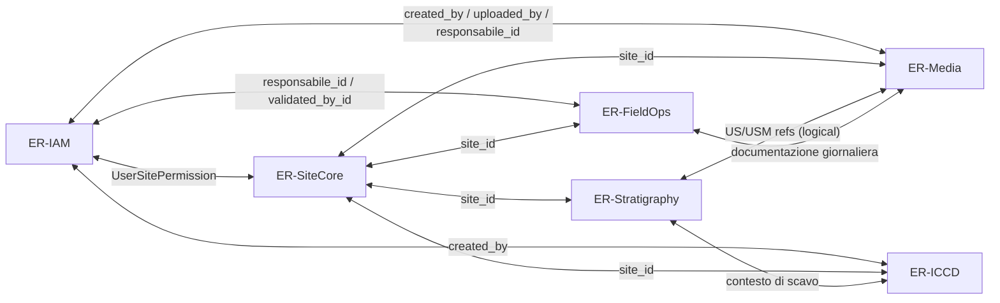
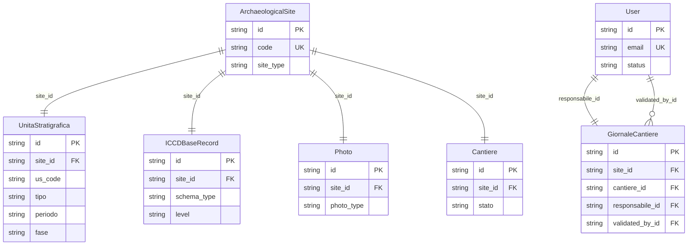

# ER Context Map - FastZoom

## Overview Entities (ridotto: PK/FK + campi critici)

## Boundaries

- **ER-IAM**: identità, ruoli, permessi, audit, session invalidation.
- **ER-SiteCore**: tenant root e geografia/cartografia.
- **ER-Stratigraphy**: unità stratigrafiche e mapping Harris.
- **ER-ICCD**: catalogazione standard ICCD + TMA normalizzato.
- **ER-Media**: documenti, foto, tavole, consegne.
- **ER-FieldOps**: cantieri e giornale operativo.

