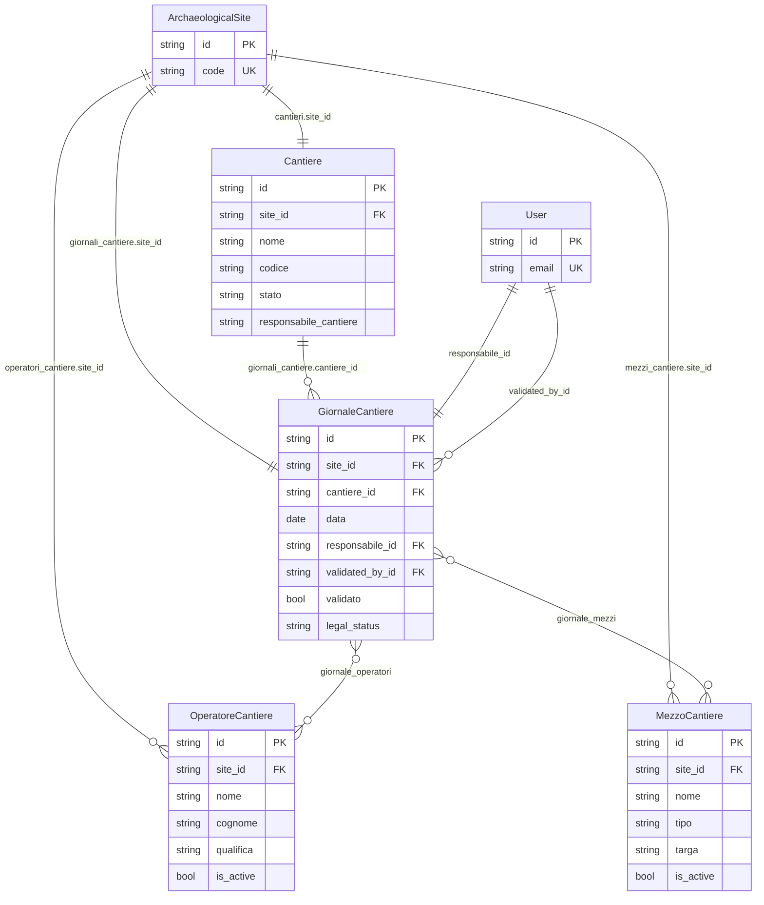

# ER-FieldOps

Nota: [`responsabile_cantiere`](app/models/cantiere.py:86) in [`Cantiere`](app/models/cantiere.py:18) è un campo testuale libero e **non** una FK verso [`User`](app/models/users.py:56).
