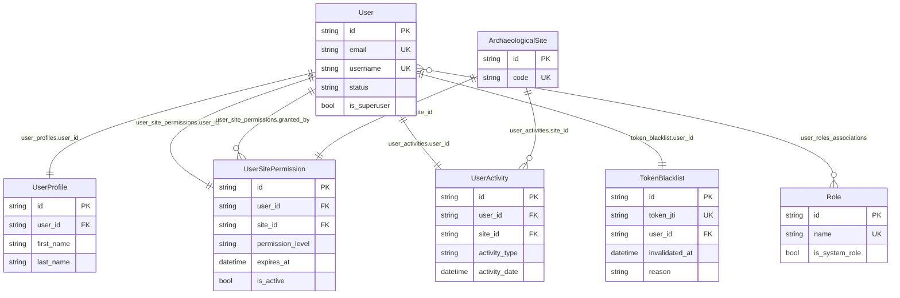

# ER-IAM

```mermaid
erDiagram
    %% ||--|| = FK NOT NULL (obbligatoria)
    %% ||--o{ = FK nullable (opzionale)
    %% }o--o{ = many-to-many via junction table

    User ||--|| UserProfile : "user_profiles.user_id"

    User ||--|| UserSitePermission : "user_site_permissions.user_id"
    User ||--o{ UserSitePermission : "user_site_permissions.granted_by"
    ArchaeologicalSite ||--|| UserSitePermission : "user_site_permissions.site_id"

    User ||--|| UserActivity : "user_activities.user_id"
    ArchaeologicalSite ||--o{ UserActivity : "user_activities.site_id"

    User ||--|| TokenBlacklist : "token_blacklist.user_id"

    User }o--o{ Role : "user_roles_associations"

    User {
        string id PK
        string email UK
        string username UK
        string status
        bool is_superuser
    }

    UserProfile {
        string id PK
        string user_id FK
        string first_name
        string last_name
    }

    Role {
        string id PK
        string name UK
        bool is_system_role
    }

    UserSitePermission {
        string id PK
        string user_id FK
        string site_id FK
        string permission_level
        datetime expires_at
        bool is_active
    }

    UserActivity {
        string id PK
        string user_id FK
        string site_id FK
        string activity_type
        datetime activity_date
    }

    TokenBlacklist {
        string id PK
        string token_jti UK
        string user_id FK
        datetime invalidated_at
        string reason
    }

    ArchaeologicalSite {
        string id PK
        string code UK
    }
```

Nota: in questo documento la simbologia è usata per evidenziare la nullability delle FK.

