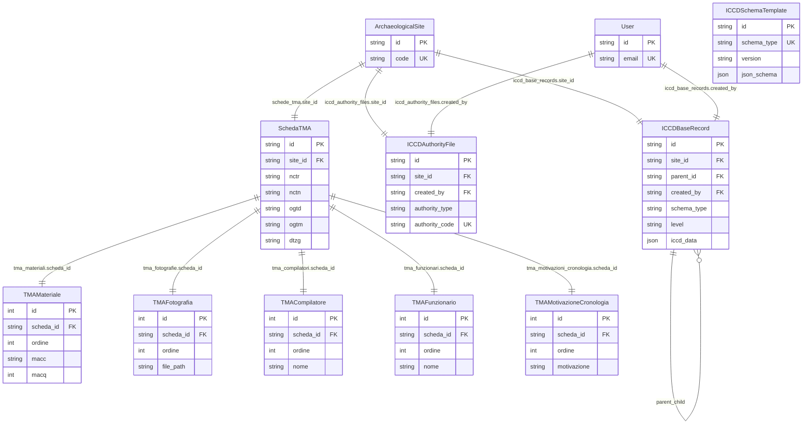

# ER-ICCD

```mermaid
erDiagram
    %% ||--|| = FK NOT NULL (obbligatoria)
    %% ||--o{ = FK nullable (opzionale)
    %% }o--o{ = many-to-many via junction table

    ArchaeologicalSite ||--|| ICCDBaseRecord : "iccd_base_records.site_id"
    ICCDBaseRecord ||--o{ ICCDBaseRecord : parent_child

    ArchaeologicalSite ||--|| ICCDAuthorityFile : "iccd_authority_files.site_id"
    User ||--|| ICCDBaseRecord : "iccd_base_records.created_by"
    User ||--|| ICCDAuthorityFile : "iccd_authority_files.created_by"

    ArchaeologicalSite ||--|| SchedaTMA : "schede_tma.site_id"
    SchedaTMA ||--|| TMAMateriale : "tma_materiali.scheda_id"
    SchedaTMA ||--|| TMAFotografia : "tma_fotografie.scheda_id"
    SchedaTMA ||--|| TMACompilatore : "tma_compilatori.scheda_id"
    SchedaTMA ||--|| TMAFunzionario : "tma_funzionari.scheda_id"
    SchedaTMA ||--|| TMAMotivazioneCronologia : "tma_motivazioni_cronologia.scheda_id"

    ICCDSchemaTemplate {
        string id PK
        string schema_type UK
        string version
        json json_schema
    }

    ICCDBaseRecord {
        string id PK
        string site_id FK
        string parent_id FK
        string created_by FK
        string schema_type
        string level
        json iccd_data
    }

    ICCDAuthorityFile {
        string id PK
        string site_id FK
        string created_by FK
        string authority_type
        string authority_code UK
    }

    SchedaTMA {
        string id PK
        string site_id FK
        string nctr
        string nctn
        string ogtd
        string ogtm
        string dtzg
    }

    TMAMateriale {
        int id PK
        string scheda_id FK
        int ordine
        string macc
        int macq
    }

    TMAFotografia {
        int id PK
        string scheda_id FK
        int ordine
        string file_path
    }

    TMACompilatore {
        int id PK
        string scheda_id FK
        int ordine
        string nome
    }

    TMAFunzionario {
        int id PK
        string scheda_id FK
        int ordine
        string nome
    }

    TMAMotivazioneCronologia {
        int id PK
        string scheda_id FK
        int ordine
        string motivazione
    }

    ArchaeologicalSite {
        string id PK
        string code UK
    }

    User {
        string id PK
        string email UK
    }
```

