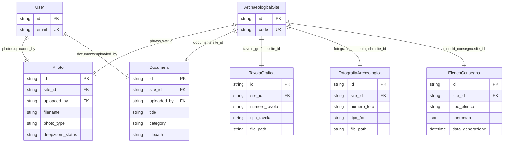

# ER-Media

Nota: i riferimenti a US/USM in [`Photo`](app/models/documentation_and_field.py:193) (`us_reference`, `usm_reference`) sono campi testuali/logici e non FK fisiche verso [`UnitaStratigrafica`](app/models/stratigraphy.py:188) o [`UnitaStratigraficaMuraria`](app/models/stratigraphy.py:386).

