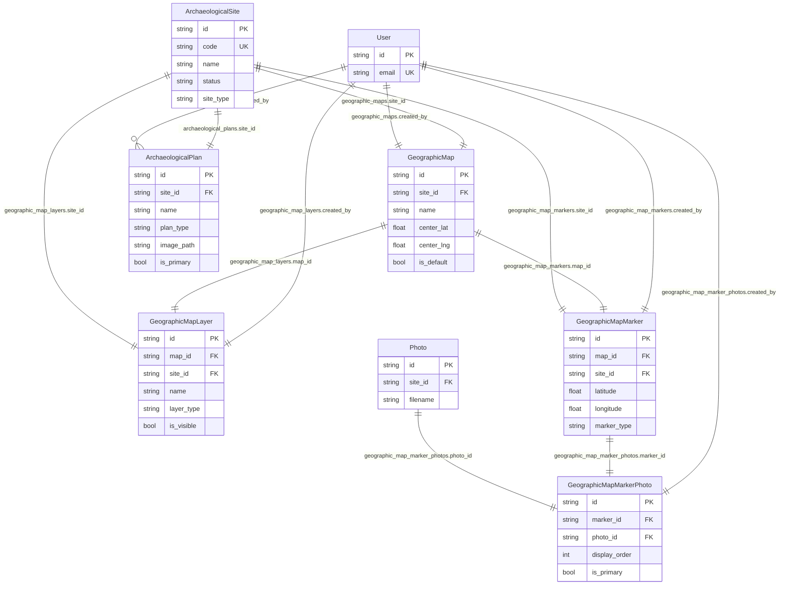

# ER-SiteCore

```mermaid
erDiagram
    %% ||--|| = FK NOT NULL (obbligatoria)
    %% ||--o{ = FK nullable (opzionale)
    %% }o--o{ = many-to-many via junction table

    ArchaeologicalSite ||--|| GeographicMap : "geographic_maps.site_id"
    ArchaeologicalSite ||--|| ArchaeologicalPlan : "archaeological_plans.site_id"

    User ||--|| GeographicMap : "geographic_maps.created_by"
    User ||--|| GeographicMapLayer : "geographic_map_layers.created_by"
    User ||--|| GeographicMapMarker : "geographic_map_markers.created_by"
    User ||--|| GeographicMapMarkerPhoto : "geographic_map_marker_photos.created_by"
    User ||--o{ ArchaeologicalPlan : "archaeological_plans.created_by"

    GeographicMap ||--|| GeographicMapLayer : "geographic_map_layers.map_id"
    ArchaeologicalSite ||--|| GeographicMapLayer : "geographic_map_layers.site_id"

    GeographicMap ||--|| GeographicMapMarker : "geographic_map_markers.map_id"
    ArchaeologicalSite ||--|| GeographicMapMarker : "geographic_map_markers.site_id"

    GeographicMapMarker ||--|| GeographicMapMarkerPhoto : "geographic_map_marker_photos.marker_id"

    Photo ||--|| GeographicMapMarkerPhoto : "geographic_map_marker_photos.photo_id"

    ArchaeologicalSite {
        string id PK
        string code UK
        string name
        string status
        string site_type
    }

    GeographicMap {
        string id PK
        string site_id FK
        string name
        float center_lat
        float center_lng
        bool is_default
    }

    GeographicMapLayer {
        string id PK
        string map_id FK
        string site_id FK
        string name
        string layer_type
        bool is_visible
    }

    GeographicMapMarker {
        string id PK
        string map_id FK
        string site_id FK
        float latitude
        float longitude
        string marker_type
    }

    GeographicMapMarkerPhoto {
        string id PK
        string marker_id FK
        string photo_id FK
        int display_order
        bool is_primary
    }

    ArchaeologicalPlan {
        string id PK
        string site_id FK
        string name
        string plan_type
        string image_path
        bool is_primary
    }

    Photo {
        string id PK
        string site_id FK
        string filename
    }

    User {
        string id PK
        string email UK
    }
```

