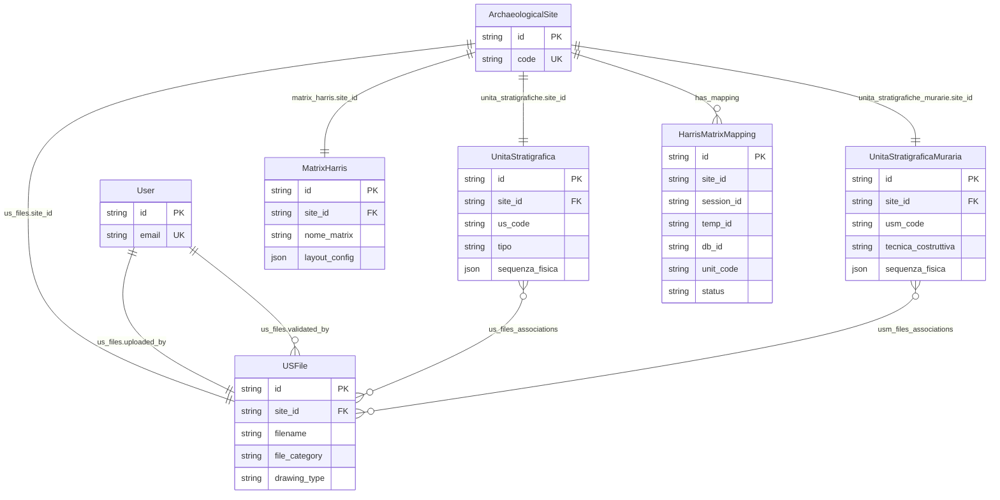

# ER-Stratigraphy

```mermaid
erDiagram
    %% ||--|| = FK NOT NULL (obbligatoria)
    %% ||--o{ = FK nullable (opzionale)
    %% }o--o{ = many-to-many via junction table

    ArchaeologicalSite ||--|| UnitaStratigrafica : "unita_stratigrafiche.site_id"
    ArchaeologicalSite ||--|| UnitaStratigraficaMuraria : "unita_stratigrafiche_murarie.site_id"
    ArchaeologicalSite ||--|| USFile : "us_files.site_id"
    ArchaeologicalSite ||--|| MatrixHarris : "matrix_harris.site_id"

    User ||--|| USFile : "us_files.uploaded_by"
    User ||--o{ USFile : "us_files.validated_by"

    UnitaStratigrafica }o--o{ USFile : us_files_associations
    UnitaStratigraficaMuraria }o--o{ USFile : usm_files_associations

    ArchaeologicalSite ||--o{ HarrisMatrixMapping : has_mapping

    UnitaStratigrafica {
        string id PK
        string site_id FK
        string us_code
        string tipo
        json sequenza_fisica
    }

    UnitaStratigraficaMuraria {
        string id PK
        string site_id FK
        string usm_code
        string tecnica_costruttiva
        json sequenza_fisica
    }

    USFile {
        string id PK
        string site_id FK
        string filename
        string file_category
        string drawing_type
    }

    MatrixHarris {
        string id PK
        string site_id FK
        string nome_matrix
        json layout_config
    }

    HarrisMatrixMapping {
        string id PK
        string site_id
        string session_id
        string temp_id
        string db_id
        string unit_code
        string status
    }

    ArchaeologicalSite {
        string id PK
        string code UK
    }

    User {
        string id PK
        string email UK
    }
```

