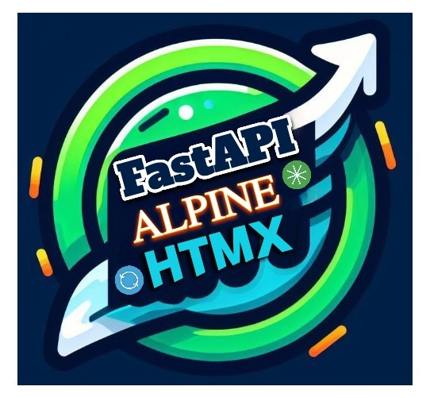
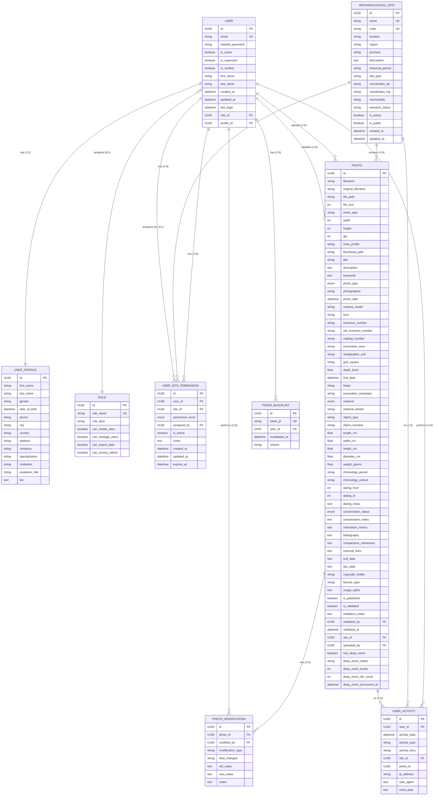

# FastZoom

<p align="center">
  
</p>

## Overview

FastZoom is a modern web application built with FastAPI, designed for managing archaeological sites and artifacts. It allows users to upload high-resolution photos, organize them by site, and view them with deep zoom capabilities using OpenSeadragon. The app supports user authentication, role-based permissions, team management, and secure file storage via MinIO. The frontend leverages HTMX for dynamic interactions, Jinja2 for templating, and Tailwind CSS with Flowbite for styling.

This project provides a robust backend for archaeological documentation, enabling collaborative workflows for teams to annotate, search, and share site photos and data.

## External Libraries Used

- [FastAPI](https://fastapi.tiangolo.com/) (^0.115.0): High-performance web framework for APIs and HTML responses.
- [SQLAlchemy](https://www.sqlalchemy.org/) (^2.0.0): ORM and SQL toolkit for database interactions.
- [Alembic](https://alembic.sqlalchemy.org/) (^1.13.0): Database migration tool.
- [Pydantic](https://docs.pydantic.dev/) (^2.8.0): Data validation and serialization.
- [Jinja2](https://jinja.palletsprojects.com/) (^3.1.0): Templating engine for HTML.
- [Alpine.js](https://alpinejs.dev/) (via CDN): Lightweight JavaScript for interactivity.
- [OpenSeadragon](https://openseadragon.github.io/) (minified JS): Deep zoom image viewer for high-res photos.
- [MinIO](https://min.io/) (Python client): Object storage for photos and deep zoom tiles.
- [Uvicorn](https://www.uvicorn.org/) (^0.30.0): ASGI server.
- [Passlib](https://passlib.readthedocs.io/) (^1.7.0): Password hashing.
- [python-multipart](https://github.com/encode/python-multipart) (^0.0.9): Form data parsing for uploads.
- [Pillow](https://pillow.readthedocs.io/) (^10.0.0): Image processing for thumbnails and tiles.

Dependencies are managed via Poetry (`pyproject.toml` and `poetry.lock`).

## Features

- **User Management**: Registration, login, password updates, profiles, and admin controls.
- **Role and Permissions**: Custom roles with granular permissions for sites and photos.
- **Site Management**: Create, edit, and organize archaeological sites with teams and user assignments.
- **Photo Upload and Storage**: Secure uploads to MinIO, automatic thumbnail generation, and deep zoom pyramid creation (DZI format).
- **Deep Zoom Viewing**: Interactive photo viewer with zoom, pan, rotate, and annotation support using OpenSeadragon.
- **Search and Filtering**: API endpoints for searching photos, sites, and artifacts.
- **Admin Dashboard**: Manage users, sites, roles, and permissions via intuitive interfaces.
- **Team Collaboration**: Invite users to sites, manage group permissions.
- **Security**: CSRF protection, JWT authentication, rate limiting prepared.
- **Responsive UI**: Mobile-friendly design with themes and modals for uploads/edits.
- **API Endpoints**: RESTful APIs for CRUD on users, sites, photos, etc.
- **Database Migrations**: Alembic for schema evolution.

### 🆕 **New Advanced Features**

- **🔍 OpenSeadragon Exclusive Viewing**: Advanced high-resolution image viewer with OpenSeadragon as the only viewing method, ensuring professional-grade archaeological photo examination with deep zoom capabilities, smooth navigation, and optimal performance for large scientific images.

- **📋 Reusable Metadata Management**: Comprehensive modular component system for archaeological metadata with a single reusable form component supporting both upload and edit workflows, ensuring consistency across all metadata operations and reducing code duplication.

- **🎨 Enhanced User Interface**:
  - **Smart Information Sidebar**: Photo metadata panel with intelligent hover zones and button triggers for non-intrusive access to archaeological information
  - **Integrated Action Bar**: Professional interface with info button relocated to top action bar alongside Download, Share, and Edit functions
  - **Responsive Design**: Mobile-optimized interface adapting to different screen sizes with dark mode support

- **⚡ Advanced Component Architecture**:
  - **Event-Driven Communication**: Clean separation of concerns using Alpine.js events for seamless parent-child component interaction
  - **Mode-Based Functionality**: Dynamic component behavior supporting 'upload' and 'edit' modes with automatic data loading
  - **Professional Workflow**: Streamlined archaeological documentation process with specialized metadata fields and validation

- **🏛️ Archaeological-Specific Features**:
  - **Complete Metadata Support**: Comprehensive fields for inventory numbers, excavation areas, stratigraphic units, materials, object types, chronological periods, and conservation status
  - **Professional Documentation**: Photographer credits, photo types, find dates, and detailed archaeological context
  - **Data Consistency**: Unified metadata structure across upload and edit operations ensuring archaeological documentation standards


## Admin Login Credentials

- **Email**: superuser@admin.com
- **Password**: password123

Use these to access the admin dashboard after setup.

## Quick Setup Using PowerShell Script

For Windows, use `setup.ps1` to automate setup.

### Commands

| Command      | Description                     |
|--------------|---------------------------------|
| setup        | Full project initialization     |
| install      | Install dependencies            |
| env          | Generate .env file              |
| migrate      | Run Alembic migrations          |
| init-db      | Initialize database             |
| run          | Start production server         |
| run-dev      | Start with auto-reload          |
| credentials  | Display admin credentials       |
| status       | Check project status            |
| clean        | Clean temporary files           |

### Usage

1. Open PowerShell in the project directory:
   ```
   cd "C:\Users\E3M\OneDrive - beniculturali.it\Desktop\FastZoom"
   ```

2. Run a command, e.g.:
   ```
   .\setup.ps1 setup
   ```

   Or start the app:
   ```
   .\setup.ps1 run-dev
   ```

## Manual Setup

### Prerequisites

- Python 3.12+
- MinIO server (local or cloud) for storage.
- PostgreSQL/SQLite for database (SQLite for dev).

### Steps

1. **Clone/Navigate**:
   ```
   git clone <repo-url>
   cd FastZoom
   ```

2. **Install Dependencies**:
   ```
   poetry install
   ```
   Or with pip:
   ```
   pip install -r requirements.txt
   ```

3. **Environment Configuration**:

   Create `.env` in the root:
   ```
   # Database
   DATABASE_URL=sqlite+aiosqlite:///./fastzoom.db

   # JWT/Security
   SECRET_KEY=your-super-secret-key-change-me
   CSRF_SECRET_KEY=your-csrf-secret-key-change-me

   # MinIO Storage
   MINIO_URL=http://localhost:9000
   MINIO_ACCESS_KEY=minioadmin
   MINIO_SECRET_KEY=minioadmin
   MINIO_BUCKET=fastzoom-bucket
   MINIO_SECURE=false

   # App
   COOKIE_SAMESITE=lax
   COOKIE_SECURE=false  # Set true for HTTPS
   ```

   **MinIO Setup**: Run MinIO locally (`minio server /data`) and create the bucket.

4. **Database Migrations**:
   ```
   alembic upgrade head
   ```

5. **Run the Application**:
   ```
   poetry run uvicorn main:app --reload --host 0.0.0.0 --port 8000
   ```

6. **Access**: Open http://localhost:8000 in your browser.

### Updating Models for Migrations

When adding new models in `app/models/`:

1. Import in `app/database/base.py` `init_models()`:
   ```python
   from ..models.new_model import NewModel  # noqa: F401
   ```

2. Generate migration:
   ```
   alembic revision --autogenerate -m "Add new model"
   ```

3. Review and apply:
   ```
   alembic upgrade head
   ```

## Project Structure

```
FastZoom/
├── app/
│   ├── core/              # Config, security, permissions
│   ├── database/          # DB session, base, migrations
│   ├── models/            # SQLAlchemy models (users, sites, photos, etc.)
│   ├── routes/            # API and view routes (admin, sites, photos)
│   ├── schema/            # Pydantic schemas
│   ├── services/          # Business logic (photo, site, MinIO, deep zoom)
│   ├── static/            # CSS, JS (OpenSeadragon, HTMX), images
│   └── templates/         # Jinja2 HTML (sites, photos, admin, modals)
├── alembic/               # Migration versions
├── tests/                 # Unit tests
├── main.py                # App entrypoint
├── pyproject.toml         # Poetry config
├── alembic.ini
├── setup.ps1              # Windows setup script
└── README.md
```

## ER Diagram



The diagram illustrates relationships between Users, Profiles, Roles, Sites, Permissions, Photos, Modifications, Activities, and Token Blacklist. Key: PK=Primary Key, FK=Foreign Key, UK=Unique Key.

## Troubleshooting

### Photo Thumbnails and Deep Zoom

- **Issue**: Missing thumbnails or DZI tiles (404 errors).
- **Cause**: Failed generation during upload or invalid MinIO paths.
- **Fix**:
  - Ensure MinIO is running and bucket accessible.
  - Run thumbnail regeneration if needed (custom script available in services).
  - Fallback images used for missing assets.
- **Deep Zoom**: Tiles generated on upload; viewer in `photo_modal.html` uses OpenSeadragon.

### MinIO Integration

- Verify credentials in `.env`.
- Test bucket access: `mc mb myminio/fastzoom-bucket` (using MinIO client).

## 🚀 Recent Enhancements (v2.0 Features)

### OpenSeadragon Integration
- **Exclusive Image Viewing**: Removed all standard image viewers to ensure OpenSeadragon is the only method for viewing archaeological photos
- **Enhanced Navigation**: Thumbnail navigation fully integrated with OpenSeadragon for seamless browsing experience
- **Professional Quality**: High-resolution image examination capabilities optimized for archaeological documentation

### Modular Component System
- **Reusable Metadata Form**: Single component serving both upload and edit workflows (`_metadata_form.html`)
- **Event-Based Architecture**: Clean component communication using Alpine.js events (`@metadata-form-submit`)
- **Code Reduction**: Eliminated ~300 lines of duplicate code through component reusability
- **Maintainable Structure**: Centralized metadata field definitions for easy maintenance and updates

### User Experience Improvements
- **Smart UI Elements**: Information sidebar with hover zones and button triggers
- **Consistent Interface**: Integrated action buttons in top navigation bar
- **Responsive Design**: Mobile-optimized interface with full dark mode support
- **Professional Workflow**: Streamlined archaeological photo documentation process

### Technical Specifications
- **Framework**: Alpine.js for reactive components
- **Styling**: Tailwind CSS with dark mode compatibility
- **Communication**: Event-driven and direct method access patterns
- **Data Binding**: Seamless parent-child component integration
- **Validation**: Extensible form validation structure
- **Initialization**: Automatic mode detection and data loading

## To-Do (Future Enhancements)

- Add search enhancements for photos/artifacts.
- Integrate Neon/PostgreSQL for production DB.
- Rate limiting and advanced logging.
- Mobile app optimizations.
- More comprehensive tests.
- Advanced annotation tools for archaeological features.

## Contributing

Contributions welcome! Fork the repo, create a branch, and submit a PR. Ensure tests pass and follow PEP 8.

## License

MIT License. See [LICENSE](LICENSE) for details.
