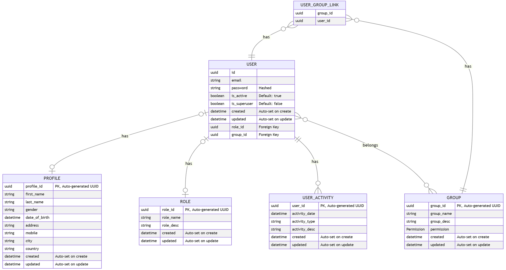

<p align="center">
  
</p>

<h1 align="center">FastAPI HTMX</h1>

<p align="center">
  Web App providing boilerplate implementation for user management, roles, groups, and CRUD operations using  HTMX, FastAPI and AlpineJS for rapid prototyping and without worrying for the user management.
</p>

## External Libraries Used

This project leverages several external libraries to provide a robust and efficient solution. Below is a brief description of each library along with a link to their documentation:

- [FastAPI](https://fastapi.tiangolo.com/) (^0.115.14): A modern, fast (high-performance), web framework for building APIs and serving HTML templates with Python 3.6+ based on standard Python type hints.
- [SQLAlchemy](https://www.sqlalchemy.org/) (^2.0.41): The Python SQL toolkit and Object Relational Mapper that gives application developers the full power and flexibility of SQL.
- [FastAPI Users](https://fastapi-users.github.io/fastapi-users/) (^14.0.1): Ready-to-use and customizable users management for FastAPI.
- [Uvicorn](https://www.uvicorn.org/) (^0.35.0): A lightning-fast ASGI server implementation, using `uvloop` and `httptools`.
- [Jinja2](https://palletsprojects.com/p/jinja/) (^3.1.6): A modern and designer-friendly templating language for Python.
- [NH3](https://github.com/Th3Whit3Wolf/nh3) (^0.2.21): A Python binding to the HTML sanitizer `h3`.
- [Alembic](https://alembic.sqlalchemy.org/en/latest/) (^1.16.2): A lightweight database migration tool for usage with the SQLAlchemy Database Toolkit.
- [AlpineJS](https://alpinejs.dev/) (loaded from CDN): A rugged, minimal framework for composing JavaScript behavior in your HTML templates.
- [Flowbite](https://flowbite.com/) (loaded from CDN): A component library built on top of Tailwind CSS for building modern web interfaces.
- [Pydantic](https://docs.pydantic.dev/2.0/) (^2.11.7): Data validation and settings management using Python type annotations.

## Features Implemented

- User Authentication and Authorization
- Role Management
- Group Management
- Dashboard for managing users, roles, and groups
- RESTful API endpoints for CRUD operations
- HTML templates for the web interface
- Database migrations with Alembic
- Unified error handling approach.

## Troubleshooting and Maintenance

### Thumbnail Issues Resolution

**Problem**: Photo thumbnails were returning 404 errors, preventing images from displaying properly in the web interface.

**Root Cause**: The database contained photos with broken thumbnail paths (set to `None` or invalid paths like `thumbnails/None.jpg`) due to failed thumbnail generation during photo uploads.

**Solutions Implemented**:

1. **Fixed Thumbnail Generation Logic** (`app/services/photo_service.py`):
   - Improved error handling in thumbnail generation
   - Better logging for debugging thumbnail issues

2. **Created Thumbnail Regeneration Script** (`scripts/regenerate_thumbnails.py`):
   - Automatically finds photos with broken thumbnail paths
   - Fixes invalid paths (like `None.jpg`)
   - Regenerates thumbnails from original files
   - Updates database with correct thumbnail paths

3. **Added Fallback Thumbnail Mechanism** (`app/routes/sites_router.py`):
   - Photos without thumbnails show a placeholder image instead of 404
   - Graceful degradation maintains UI functionality
   - Uses `app/static/img/logo/None_thumb.jpg` as fallback

**Usage**:

To regenerate thumbnails for existing photos with broken paths:

```bash
python scripts/regenerate_thumbnails.py
```

**Current Status**:
- ✅ Thumbnail routes properly implemented
- ✅ Fallback mechanism for missing thumbnails
- ✅ Script available for regenerating existing thumbnails
- ✅ Error handling improved in thumbnail generation

**Database Status** (as of last run):
- 5 photos with broken thumbnail paths identified
- 3 photos with invalid paths (fixed)
- 2 photos with `None` paths (using fallback thumbnails)

## To-Do (Future Enhancements)

- 🎨 Implement Theming using Flowbite and Tailwind
- 🚦 Implement a rate limiter to prevent abuse and ensure fair usage
- ✅ 📦 Integrate MinIO object storage for efficient file saving and management **[Completed]**
- 🔑 Add functionality to allow users to update their passwords
- 🔄 Implement a password reset feature on the login page
- ⚡ Implement rendering of blocks using FastAPI Fragment instead of reloading complete page or partials **[In Progress]**
- 📝 Develop a logging service to track and analyze user activity
- ✅ 🛡️ Implement CSRF protection to enhance security **[Completed]**
- 💾 Integrate Neon database (SQLite) for production use **[In Progress]**
- ✅ 🎨 Replace HyperScript code with Alpine JS **[Completed]**
- ✅ 🚀 Boilerplate code to work with Python 12 and HTMX 2 **[Completed]**
- ✅ 📱 Fixing the GUI issues appearing in mobile view **[Completed]**
- 🧪 Add more tests
- 🔧 Wrapper to handle the pydantic models inputs efficiently from front end **[In Progress]**

## Demo

<p align="center">
  
</p>

## Admin Login Credential

- **email:** superuser@admin.com
- **password:** password123

## Quick Setup Using PowerShell Script

For Windows users, you can use the provided `setup.ps1` script to automate the setup and management of your FastAPI-HTMX project. This script covers all essential project operations.

### Available Commands

| Command     | Description                         |
| ----------- | ----------------------------------- |
| setup       | Complete project setup              |
| install     | Install dependencies only           |
| env         | Create .env file                    |
| migrate     | Run database migrations             |
| init-db     | Initialize database with migrations |
| run         | Start the application               |
| run-dev     | Start in development mode           |
| credentials | Show admin login credentials        |
| status      | Show project status                 |
| clean       | Clean up generated files            |

### Usage

1. **Open PowerShell** and navigate to your project directory:
   ```powershell
   cd "C:\Users\mahmad\Desktop\Coding\FastAPI-HTMX"
   ```
2. **Run a command** (for example, to set up the project):
   ```powershell
   .\setup.ps1 setup
   ```
   Or to start the application:
   ```powershell
   .\setup.ps1 run
   ```

---

## Manual Setup Procedure

You can also set up and manage the project manually using the following steps:

### Creating the `.env` File

Create a `.env` file in the root directory of the project and add the following environment variables:

```
# Database Configuration
DATABASE_URL="sqlite+aiosqlite:///./users.db"
SECRET_KEY="super-secret-key-example-123456789"

# MinIO Configuration (Required for file uploads)
MINIO_URL="http://localhost:9000"
MINIO_ACCESS_KEY="minioadmin123456789"
MINIO_SECRET_KEY="miniosecret987654321xyz"
MINIO_BUCKET="my-fastapi-bucket"
MINIO_SECURE=false

# CSRF Protection
CSRF_SECRET_KEY="csrf-secret-key-example-987654321"
COOKIE_SAMESITE="lax"
COOKIE_SECURE=true
```

Replace `your_secret_key` with a strong secret key for your application.

**Note:** While using sample MinIO credentials will allow the database to record file uploads, the actual files won't be stored without valid MinIO server credentials. For full file storage functionality, set up a MinIO server or use valid MinIO service credentials.

### Running the Project

1. **Clone the repository:**

   ```sh
   git clone https://github.com/yourusername/project-management.git
   cd project-management
   ```

2. **Install dependencies:**
   If you are using `poetry`, run:

   ```sh
   poetry install
   ```

   If you are using `pip`, run:

   ```sh
   pip install -r requirements.txt
   ```

3. **Run database migrations:**

   ```sh
   alembic upgrade head
   ```

4. **Run database migrations:**

   ```sh
   alembic revision --autogenerate -m "Initial migration"
   ```

5. **Insert Required import in Migration File:**

   After generating the initial migration, open the newly created revision file in app/migrations/versions/ and add the following imports at the top of the file:

   ```sh
   import fastapi_users_db_sqlalchemy.generics
   import app.models.groups
   ```

6. **Apply the changes:**

   ```sh
   alembic upgrade head
   ```

7. **Start the application:**
   If you are using `poetry`, run:

   ```sh
   poetry run python main.py
   ```

   If you are using `uvicorn` directly, run:

   ```sh
   uvicorn main:app --reload
   ```

8. **Access the application:**
   Open your web browser and navigate to `http://127.0.0.1:8080`.

## Updating Model References in `init_models`

When you define a new **Database model** in your application, it's essential to update the `init_models` function to ensure that Alembic can detect and generate migrations for this new model correctly. This step is crucial for maintaining the integrity of your database schema and ensuring that all models are correctly versioned.

### Steps to Update `init_models`

1. **Locate `init_models` Function**: Open the `base.py` file in `app/database/base.py`. This file contains the `init_models` function, which is responsible for importing all the models in your application.

2. **Add New Model Import**: Once you have defined a new model in your application, you need to import it in the `init_models` function. Ensure that you follow the existing import structure. For example, if your new model is `Invoice` and it's located in the `models.financial` module, you would add the following line:

   ```python
   from ..models.financial import Invoice  # noqa: F401
   ```

   The `# noqa: F401` comment at the end of the import statement tells the linter to ignore the "imported but unused" warning, as the import is necessary for Alembic to detect and generate migrations for the model.

3. **Follow Import Conventions**: If you have multiple models in the same module, you can import them in a single line to keep the `init_models` function organized. For example:

   ```python
   from ..models.financial import Invoice, Payment, Transaction  # noqa: F401
   ```

4. **Save Changes**: After adding the import statement for your new model, save the changes to the `base.py` file.

5. **Generate Alembic Migration**: With the new model imported in the `init_models` function, you can now generate an Alembic migration script that includes this model. Run the Alembic command to autogenerate a migration:

   ```bash
   alembic revision --autogenerate -m "Added new model Invoice"
   ```

6. **Review and Apply Migration**: Always review the generated migration script to ensure it accurately represents the changes to your models. After reviewing, apply the migration to update your database schema:

   ```bash
   alembic upgrade head
   ```

## Project Structure

Below is an overview of the project structure for application. This structure is designed to organize the application's components logically, making it easier to navigate and maintain.

```bash
FastAPI-HTMX/
├── app/
│ ├── core/             # Core application logic and utilities
│ │ ├── config.py         # Application configuration
│ │ └── security.py       # Security utilities
│ ├── database/         # Database configurations and connections
│ │ ├── base.py           # Base database setup
│ │ └── session.py        # Database session management
│ ├── migrations/         # Alembic migration scripts
│ ├── models/           # SQLAlchemy ORM models
│ │ ├── groups.py         # Group model definitions
│ │ ├── roles.py          # Role model definitions
│ │ └── users.py          # User model definitions
│ ├── routes/           # API route definitions
│ │ ├── api/
│ │ │ ├── auth.py         # Authentication endpoints
│ │ │ └── users.py        # User management endpoints
│ │ └── view/           # View routes for web interface
│ │   ├── group.py        # Group management views
│ │   ├── role.py         # Role management views
│ │   └── view_crud.py    # SQLAlchemyCRUD class
│ ├── schema/           # Pydantic schemas
│ │ ├── group.py          # Group schemas
│ │ ├── role.py           # Role schemas
│ │ └── user.py           # User schemas
│ ├── static/           # Static files
│ │ ├── css/              # Stylesheets
│ │ ├── js/               # JavaScript files
│ │ └── img/              # Images and assets
│ └── templates/        # Jinja2 HTML templates
│   ├── auth/             # Authentication templates
│   ├── components/       # Reusable components
│   └── partials/         # Partial templates
├── tests/              # Unit and integration tests
├── .env                # Environment variables
├── alembic.ini         # Alembic configuration
├── main.py             # Application entry point
├── poetry.lock         # Poetry dependencies lock
├── pyproject.toml      # Project configuration
└── README.md           # Project documentation
```

## ER Diagram

Here's the Entity-Relationship (ER) diagram for database:



## Contributing

Contributions are welcome! Please open an issue or submit a pull request for any changes.

## License

This project is licensed under the MIT License. See the [LICENSE](LICENSE) file for details.
