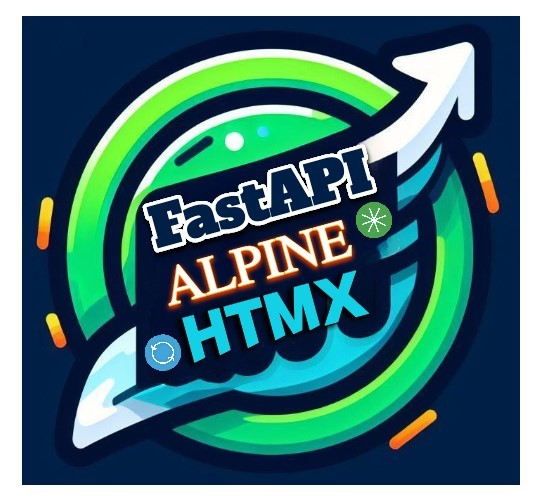

# FastZoom

<p align="center">
  
</p>

FastZoom is a FastAPI web platform for archaeological documentation and site operations. It combines site management, stratigraphy workflows, photo/deep zoom handling, ICCD-aligned records, and team-based permissions in one application.

## Main Features

- Multi-site and multi-tenant access control
- US/USM stratigraphic records and Harris Matrix workflows
- Archaeological cataloging and documentation
- Photo upload, thumbnails, and Deep Zoom tile generation
- ICCD data entry and hierarchy support
- Site dashboards, mapping, and administrative tools
- Voice assistant integration (Pipecat-based modules in `app/services`)

## Tech Stack

- FastAPI, Uvicorn
- SQLAlchemy + Alembic
- Jinja2 + HTMX + Alpine.js + Tailwind/Flowbite
- MinIO object storage
- SQLite (default local dev DB) with async driver

## Prerequisiti

- **Docker Desktop** (include Docker + Docker Compose)
- File `.env` compilato a partire da `.env.example`

## Quick Start

```powershell
# 1. Copia il file di configurazione
Copy-Item .env.example .env

# 2. Avvia in modalità sviluppo (foreground, auto-reload)
.\setup.ps1 run-dev
```

Apri il browser su:
- App → `http://localhost:8000`
- Swagger UI → `http://localhost:8000/docs`
- MinIO Console → `http://localhost:9001`

## Comandi `setup.ps1`

Tutti i comandi usano Docker Compose. Richiedono Docker Desktop avviato.

| Comando | Descrizione |
|---|---|
| `run-dev` | Avvia in foreground con **auto-reload** (sviluppo) |
| `run` | Avvia in background / detached (produzione) |
| `stop` | Ferma tutti i container |
| `restart` | Ferma e riavvia i container |
| `build` | Rebuild immagine Docker (no cache) |
| `logs` | Stream log in tempo reale (tutti i container) |
| `logs-app` | Log solo del container `app` |
| `logs-minio` | Log solo di MinIO |
| `status` | Stato dei container (`docker compose ps`) |
| `shell` | Shell bash interattiva nel container `app` |
| `credentials` | Mostra credenziali di accesso |
| `clean` | Rimuove container, volumi e immagini (con conferma) |

```powershell
# Esempi
.\setup.ps1 run-dev      # sviluppo
.\setup.ps1 logs         # vedi i log live
.\setup.ps1 stop         # ferma tutto
.\setup.ps1 shell        # apri una shell nel container
.\setup.ps1 clean        # pulizia completa
```

## Environment Configuration

The project reads settings from `.env` (see `.env.example`). Core variables:

- `DATABASE_URL`
- `SECRET_KEY`
- `CSRF_SECRET_KEY`
- `MINIO_CONFIG_PROFILE` (`local` or `remote`)
- `MINIO_LOCAL_URL`, `MINIO_LOCAL_ACCESS_KEY`, `MINIO_LOCAL_SECRET_KEY`, `MINIO_LOCAL_BUCKET`
- `MINIO_REMOTE_URL`, `MINIO_REMOTE_ACCESS_KEY`, `MINIO_REMOTE_SECRET_KEY`, `MINIO_REMOTE_BUCKET`

For local Docker Compose, `MINIO_LOCAL_URL=http://minio:9000` is expected.

## Default Credentials

Development seed/admin credentials currently used by scripts:

- Email: `superuser@admin.com`
- Password: `password123`

Update these for non-development environments.

## Testing

Run tests:

```powershell
pytest
```

Coverage output is configured in `pytest.ini` (`htmlcov/` and terminal report).

## Project Structure

```text
FastZoom/
  app/
    core/          # Config, security, middleware
    database/      # Engine, sessions, DB bootstrap
    models/        # SQLAlchemy models
    routes/        # API and HTML routes
    schemas/       # Pydantic schemas
    services/      # Business logic and integrations
    static/        # Frontend assets
    templates/     # Jinja2 templates
  alembic/         # Migration scaffolding
  tests/           # Test suite
  docker-compose.yml
  main.py
  README.md
```

## API Docs

When the app is running:

- Swagger UI: `http://localhost:8000/docs`
- ReDoc: `http://localhost:8000/redoc`

## Additional Documentation

- `ER_DIAGRAM_COMPLETE.md`
- `DESIGN_PATTERNS.md`
- `REFACTORING_GUIDE.md`
- `integration-instructions.md`

## License

MIT (see `LICENSE` if present in your distribution).
